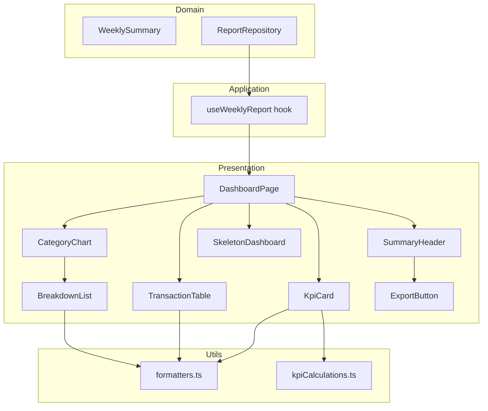

# Design Document: Executive Dashboard Redesign

## Overview

Thiết kế lại trang Report Page từ layout linear đơn giản (max-w-2xl, stacked) thành một Executive Dashboard dạng grid responsive, phù hợp cho quản lý cấp cao. Thiết kế giữ nguyên kiến trúc Clean Architecture hiện tại, tận dụng data flow có sẵn qua `useWeeklyReport` hook, và mở rộng presentation layer với các component mới.

**Quyết định thiết kế chính:**
- Refactor `ReportPage` thành `DashboardPage` với CSS Grid layout
- Tách logic tính toán KPI ra utility functions thuần túy (dễ test)
- Giữ nguyên domain entities (`WeeklySummary`, `Transaction`) — không thay đổi API contract
- Component composition: chia nhỏ thành các widget độc lập, mỗi widget nhận props rõ ràng

## Architecture

### Kiến trúc tổng thể



### Grid Layout

```mermaid
graph LR
    subgraph Desktop >= 1024px
        direction TB
        A[Summary Header - full width]
        B[KPI 1]
        C[KPI 2]
        D[KPI 3]
        E[KPI 4]
        F[Category Chart + Breakdown - span 1 col]
        G[Transaction Table - span 1 col]
    end
```

**Desktop (≥1024px):** Grid 12 cột
- Summary Header: span 12
- KPI cards: mỗi card span 3 (4 cards = 12)
- Category Chart + Breakdown: span 5
- Transaction Table: span 7

**Mobile (<1024px):** Single column, tất cả components stack vertical.

## Components and Interfaces

### 1. DashboardPage

Thay thế `ReportPage` hiện tại. Orchestration component chịu trách nhiệm layout grid và routing state (loading/error/success).

```typescript
// presentation/pages/DashboardPage.tsx
interface DashboardPageProps {
  repository: ReportRepository;
  token: string | null;
}
```

Layout sử dụng Tailwind CSS Grid:
```
className="grid grid-cols-1 gap-4 lg:grid-cols-12 lg:gap-6"
```

### 2. SummaryHeader

Header chứa tiêu đề, date range, và ExportButton.

```typescript
// presentation/components/SummaryHeader.tsx
interface SummaryHeaderProps {
  from: Date;
  to: Date;
  repository: ReportRepository;
  token: string;
}
```

### 3. KpiCard

Component tái sử dụng cho mỗi KPI metric.

```typescript
// presentation/components/KpiCard.tsx
interface KpiCardProps {
  label: string;
  value: string;
  icon?: string;
  ariaLabel: string;
}
```

Mỗi card sẽ render:
- Icon (emoji hoặc SVG) phía trên
- Value lớn với font-mono tabular-nums
- Label nhỏ phía dưới với text-ink-dim
- Border-line bg-terminal, hover subtle glow

### 4. CategoryChart (Enhanced)

Refactor component hiện tại để thêm breakdown list bên cạnh.

```typescript
// presentation/components/CategoryChart.tsx
interface CategoryChartProps {
  byCategory: CategorySummary[];
  total: number;
}
```

Bên trong component sẽ chứa:
- Doughnut chart (trái/trên)
- `BreakdownList` (phải/dưới)

### 5. BreakdownList

Component mới hiển thị danh sách phân bổ chi tiết.

```typescript
// presentation/components/BreakdownList.tsx
interface BreakdownItem {
  category: string;
  amount: number;
  percentage: number;
}

interface BreakdownListProps {
  items: BreakdownItem[];
}
```

Mỗi item render: tên danh mục, progress bar (width = percentage%), giá trị tiền.

### 6. TransactionTable (Enhanced)

Mở rộng component hiện tại với pagination và summary row.

```typescript
// presentation/components/TransactionTable.tsx
interface TransactionTableProps {
  transactions: Transaction[];
}

// Internal state
const PAGE_SIZE = 10;
const [showAll, setShowAll] = useState(false);
```

### 7. SkeletonDashboard

Skeleton loading UI replicate layout structure.

```typescript
// presentation/components/SkeletonDashboard.tsx
// No props — renders pulse animation placeholders matching grid layout
```

### 8. Utility Functions (Pure)

```typescript
// presentation/utils/formatters.ts
export function formatCurrency(amount: number): string;
export function formatDateRange(from: Date, to: Date): string;

// presentation/utils/kpiCalculations.ts
export interface KpiValues {
  total: string;
  transactionCount: number;
  average: string;
  topCategory: string;
}

export function computeKpis(summary: WeeklySummary): KpiValues;
export function computeCategoryBreakdown(
  byCategory: CategorySummary[],
  total: number
): BreakdownItem[];
```

## Data Models

### Existing (không thay đổi)

```typescript
// domain/entities/WeeklySummary.ts — giữ nguyên
interface WeeklySummary {
  total: number;
  byCategory: CategorySummary[];
  transactions: Transaction[];
  from: Date;
  to: Date;
}

interface CategorySummary {
  category: string;
  total: number;
}

interface Transaction {
  id?: string;
  amount: number;
  category: string;
  note: string;
  spentAt?: string;
  createdAt?: string;
}
```

### Derived (presentation layer)

```typescript
// Computed từ WeeklySummary, không persist
interface KpiValues {
  total: string;           // formatted currency
  transactionCount: number;
  average: string;         // formatted currency  
  topCategory: string;     // category name
}

interface BreakdownItem {
  category: string;
  amount: number;       // raw number
  percentage: number;   // 0-100
}
```

### State Management

Không thêm state management library. Giữ nguyên pattern hiện tại:
- `useWeeklyReport` hook quản lý fetch state (loading/error/success)
- `TransactionTable` dùng local `useState` cho pagination (`showAll`)
- Tất cả derived data (KPIs, breakdown) được compute inline từ `WeeklySummary`

## Correctness Properties

*A property is a characteristic or behavior that should hold true across all valid executions of a system — essentially, a formal statement about what the system should do. Properties serve as the bridge between human-readable specifications and machine-verifiable correctness guarantees.*

### Property 1: Currency formatting preserves numeric value

*For any* non-negative number, formatting it as Vietnamese currency and then extracting the digits should yield the original integer value (với số nguyên) — tức là formatting là lossless.

**Validates: Requirements 2.2**

### Property 2: KPI computation correctness

*For any* valid WeeklySummary with at least one transaction, the computed KPIs shall satisfy:
- `transactionCount` equals `transactions.length`
- `average` equals `total / transactions.length` (rounded)
- `topCategory` equals the name of the category with maximum total in `byCategory`

**Validates: Requirements 2.3, 2.4, 2.5**

### Property 3: Date range formatting produces valid vi-VN output

*For any* pair of valid Dates (from ≤ to), the formatted date range string should contain both dates in dd/mm/yyyy format separated by a delimiter.

**Validates: Requirements 3.2**

### Property 4: Category breakdown percentages sum to 100

*For any* non-empty byCategory array, the computed breakdown percentages should sum to 100 (within rounding tolerance of ±1), and each individual percentage should equal `(category.total / sum_of_all_totals) * 100`.

**Validates: Requirements 4.3**

### Property 5: Transaction default sort order is descending by date

*For any* list of transactions with spentAt dates, after applying the default sort, each transaction's spentAt should be ≥ the next transaction's spentAt (newest first).

**Validates: Requirements 5.2**

### Property 6: Pagination shows at most PAGE_SIZE items initially

*For any* list of transactions with length > 10, the initially visible list should contain exactly 10 items. For lists with length ≤ 10, all items should be visible.

**Validates: Requirements 5.3**

### Property 7: Summary row total equals sum of displayed transaction amounts

*For any* list of transactions, the summary row total should equal the sum of all transaction amounts in the full list (not just currently displayed page).

**Validates: Requirements 5.4**

## Error Handling

### Loading State
- `ReportState.status === "loading"` → render `SkeletonDashboard`
- Skeleton mirrors grid layout: 4 KPI card placeholders + chart placeholder + table placeholder
- Sử dụng Tailwind `animate-pulse` trên `bg-line/50` rectangles

### Error State
- `ReportState.status === "error"` → render error card
- Card có `border-amber bg-terminal` với icon cảnh báo
- Hiển thị `state.message` và gợi ý: "Vui lòng kiểm tra lại đường link báo cáo"

### Edge Cases

| Trường hợp | Xử lý |
|---|---|
| `transactions` rỗng | Table hiển thị empty state message |
| `byCategory` rỗng | Chart hiển thị "Chưa có dữ liệu danh mục" |
| `transactions.length === 0` khi tính average | Hiển thị "0đ" thay vì NaN/Infinity |
| `spentAt` undefined cho một transaction | Sort coi như epoch 0 (cuối danh sách) |
| `token` null | Error state với message hướng dẫn |

## Testing Strategy

### Property-Based Testing

**Library:** [fast-check](https://github.com/dubzzz/fast-check) — thư viện PBT phổ biến nhất cho TypeScript/JavaScript.

**Configuration:**
- Mỗi property test chạy tối thiểu 100 iterations
- Sử dụng `fc.assert(fc.property(...), { numRuns: 100 })`

**Target functions cho PBT:**
- `formatCurrency()` — Property 1
- `computeKpis()` — Property 2
- `formatDateRange()` — Property 3
- `computeCategoryBreakdown()` — Property 4
- Sort logic trong `TransactionTable` — Property 5
- Pagination logic — Property 6
- Summary row calculation — Property 7

**Tag format:** Mỗi test sẽ có comment:
```typescript
// Feature: executive-dashboard-redesign, Property 1: Currency formatting preserves numeric value
```

### Unit Testing (Example-based)

**Library:** Vitest (đã có Vite, tích hợp tự nhiên)

**Test cases:**
- Render 4 KPI cards khi data loaded (Req 2.1)
- SummaryHeader hiển thị đúng title và date range (Req 3.1, 3.2)
- ExportButton vị trí đúng trong header (Req 3.3)
- Doughnut chart config đúng (Req 4.1)
- Tooltip format đúng (Req 4.2)
- Empty state cho byCategory rỗng (Req 4.4)
- Empty state cho transactions rỗng (Req 5.5)
- Skeleton loading hiển thị khi status=loading (Req 6.1)
- Error card hiển thị khi status=error (Req 6.2)
- Semantic HTML structure (Req 7.2)
- aria-label presence trên KPI cards (Req 7.3)

### Component Testing

Sử dụng `@testing-library/react` cho component rendering tests:
- Verify grid layout classes
- Verify responsive breakpoint behavior (mock viewport)
- Verify "Xem thêm" button interaction

### Cân bằng Unit vs Property Tests

- **Property tests** cover logic layer: formatters, calculations, sort, pagination
- **Unit tests** cover rendering layer: component output, DOM structure, interaction
- Không viết quá nhiều unit test cho logic đã được property test cover
