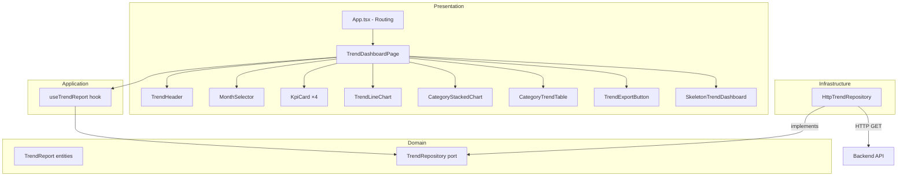
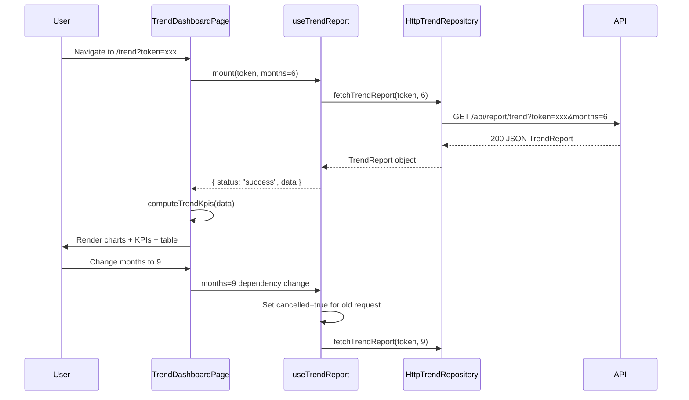

# Tài liệu Thiết kế — Báo cáo Xu hướng (Trend Report)

## Overview

Tính năng Trend Report bổ sung trang `/trend` vào ứng dụng expense-report-web hiện tại, cho phép người dùng phân tích chi tiêu đa tháng (3–12 tháng) với biểu đồ xu hướng, phân bổ danh mục, và xuất Excel. Thiết kế tuân thủ kiến trúc Clean Architecture đã có, tạo các layer mới (domain entities, port, infrastructure implementation, hook, page) mà không sửa đổi code hiện tại ngoại trừ `App.tsx` cho routing.

### Quyết định thiết kế chính

| Quyết định | Lý do |
|---|---|
| TrendRepository port riêng biệt | Không vi phạm Single Responsibility của ReportRepository; mỗi aggregate root có port riêng |
| Reuse KpiCard, ExportButton pattern | Đảm bảo UI nhất quán, giảm code trùng lặp |
| Chart.js Line + Bar stacked | Đã có chart.js trong project, không thêm dependency mới |
| computeTrendKpis utility tách biệt | Testable thuần túy, tái sử dụng dễ dàng |
| Month selector state lifted lên TrendDashboardPage | Cho phép hook refetch khi months thay đổi |

---

## Architecture

### Component/Module Diagram



### Data Flow



---

## Components and Interfaces

### File Structure (files mới)

```
src/
├── domain/
│   ├── entities/
│   │   └── TrendReport.ts          ← Domain entities/interfaces
│   └── ports/
│       └── TrendRepository.ts       ← Port interface
├── infrastructure/
│   └── api/
│       └── HttpTrendRepository.ts   ← HTTP implementation
├── application/
│   └── hooks/
│       └── useTrendReport.ts        ← React hook
├── presentation/
│   ├── pages/
│   │   └── TrendDashboardPage.tsx   ← Page component
│   ├── components/
│   │   ├── TrendHeader.tsx          ← Header + title + date range
│   │   ├── MonthSelector.tsx        ← Month count selector (3-12)
│   │   ├── TrendLineChart.tsx       ← Line chart component
│   │   ├── CategoryStackedChart.tsx ← Stacked bar chart
│   │   ├── CategoryTrendTable.tsx   ← Category trend table
│   │   ├── TrendExportButton.tsx    ← Export button (trend)
│   │   └── SkeletonTrendDashboard.tsx ← Loading skeleton
│   └── utils/
│       └── trendKpiCalculations.ts  ← computeTrendKpis utility
└── App.tsx                          ← Modified: add /trend route
```

### Component Responsibilities

| Component | Trách nhiệm |
|---|---|
| `TrendDashboardPage` | Orchestrate layout, call hook, pass data to children |
| `TrendHeader` | Hiển thị title, date range, chứa MonthSelector và ExportButton |
| `MonthSelector` | `<select>` cho phép chọn 3–12 tháng, controlled component |
| `TrendLineChart` | Chart.js Line chart cho totalSpent theo tháng |
| `CategoryStackedChart` | Chart.js Bar stacked cho phân bổ danh mục |
| `CategoryTrendTable` | Bảng HTML hiển thị direction, changePercent, averageMonthly |
| `TrendExportButton` | Nút xuất Excel, manage loading/error state |
| `SkeletonTrendDashboard` | Placeholder animate-pulse cho loading state |
| `computeTrendKpis` | Pure function tính KPI values từ TrendReport |

---

## Data Models

### Domain Entities (`src/domain/entities/TrendReport.ts`)

```typescript
export type TrendDirection = "increasing" | "decreasing" | "stable";

export interface CategoryAmount {
  category: string;
  amount: number; // >= 0
}

export interface MonthlyBreakdown {
  month: string;        // format YYYY-MM
  monthLabel: string;   // tên hiển thị, e.g. "Tháng 6/2024"
  totalSpent: number;   // >= 0
  totalIncome: number;  // >= 0
  transactionCount: number; // integer >= 0
  byCategory: CategoryAmount[];
  topCategory: string;
}

export interface CategoryTrend {
  category: string;
  monthlyAmounts: number[]; // length === monthsCount, each >= 0
  changePercent: number;
  direction: TrendDirection;
  averageMonthly: number; // >= 0
}

export interface TrendOverview {
  totalSpent: number;        // >= 0
  averageMonthlySpent: number; // >= 0
  highestMonth: string;      // format YYYY-MM
  lowestMonth: string;       // format YYYY-MM
  overallDirection: TrendDirection;
  overallChangePercent: number;
  hasIncompleteData: boolean;
  monthsWithData: number;    // 1–12
}

export interface TrendReport {
  userId: string;
  periodStart: string;       // ISO 8601 date YYYY-MM-DD
  periodEnd: string;         // ISO 8601 date YYYY-MM-DD
  monthsCount: number;       // 3–12
  overview: TrendOverview;
  monthlyBreakdown: MonthlyBreakdown[];
  categoryTrends: CategoryTrend[];
  topGrowingCategories: CategoryTrend[];
  topShrinkingCategories: CategoryTrend[];
  generatedAt: string;       // ISO 8601 datetime
}
```

### Port Interface (`src/domain/ports/TrendRepository.ts`)

```typescript
import { TrendReport } from "../entities/TrendReport";

export interface TrendRepository {
  fetchTrendReport(token: string, months?: number, endMonth?: string): Promise<TrendReport>;
  exportTrendReport(token: string, months?: number, endMonth?: string): Promise<void>;
}
```

### Hook State Type (`src/application/hooks/useTrendReport.ts`)

```typescript
export type TrendReportState =
  | { status: "loading" }
  | { status: "error"; message: string }
  | { status: "success"; data: TrendReport };
```

### Utility Return Type (`src/presentation/utils/trendKpiCalculations.ts`)

```typescript
export interface TrendKpiValues {
  totalFormatted: string;          // e.g. "1.500.000đ"
  averageMonthlyFormatted: string; // e.g. "250.000đ"
  highestMonth: string;            // monthLabel, e.g. "Tháng 3/2024"
  lowestMonth: string;             // monthLabel, e.g. "Tháng 1/2024"
}
```

### Key Algorithm: `computeTrendKpis`

```typescript
import { TrendReport } from "../../domain/entities/TrendReport";
import { formatCurrency } from "./formatters";

export function computeTrendKpis(report: TrendReport): TrendKpiValues {
  const { overview, monthlyBreakdown } = report;

  if (monthlyBreakdown.length === 0) {
    return {
      totalFormatted: "0đ",
      averageMonthlyFormatted: "0đ",
      highestMonth: "—",
      lowestMonth: "—",
    };
  }

  // Tìm tháng chi nhiều nhất (first occurrence nếu tie)
  const highest = monthlyBreakdown.reduce((max, m) =>
    m.totalSpent > max.totalSpent ? m : max
  );

  // Tìm tháng chi ít nhất (first occurrence nếu tie)
  const lowest = monthlyBreakdown.reduce((min, m) =>
    m.totalSpent < min.totalSpent ? m : min
  );

  return {
    totalFormatted: formatCurrency(overview.totalSpent),
    averageMonthlyFormatted: formatCurrency(overview.averageMonthlySpent),
    highestMonth: highest.monthLabel,
    lowestMonth: lowest.monthLabel,
  };
}
```

### Chart.js Configuration

#### Line Chart (TrendLineChart)

```typescript
import {
  Chart as ChartJS,
  CategoryScale,
  LinearScale,
  PointElement,
  LineElement,
  Tooltip,
} from "chart.js";
import { Line } from "react-chartjs-2";

ChartJS.register(CategoryScale, LinearScale, PointElement, LineElement, Tooltip);

// Data config
const data = {
  labels: monthlyBreakdown.map(m => m.monthLabel),
  datasets: [{
    data: monthlyBreakdown.map(m => m.totalSpent),
    borderColor: "#4ADE80",      // jade
    backgroundColor: "#4ADE80",
    pointBackgroundColor: "#4ADE80",
    pointRadius: 5,
    pointHoverRadius: 7,
    tension: 0,                   // straight lines
    borderWidth: 2,
  }],
};

// Options config
const options = {
  responsive: true,
  maintainAspectRatio: false,
  scales: {
    x: {
      ticks: { color: "#8FA79C" },    // ink-dim
      grid: { color: "#24413A" },      // line
    },
    y: {
      beginAtZero: true,
      ticks: {
        color: "#8FA79C",
        callback: (value) => formatCurrency(Number(value)),
      },
      grid: { color: "#24413A" },
    },
  },
  plugins: {
    tooltip: {
      callbacks: {
        label: (ctx) => formatCurrency(Number(ctx.raw)),
      },
    },
    legend: { display: false },
  },
};
```

#### Stacked Bar Chart (CategoryStackedChart)

```typescript
import {
  Chart as ChartJS,
  CategoryScale,
  LinearScale,
  BarElement,
  Tooltip,
} from "chart.js";
import { Bar } from "react-chartjs-2";

ChartJS.register(CategoryScale, LinearScale, BarElement, Tooltip);

// Lấy tất cả danh mục duy nhất, sắp xếp theo tổng chi giảm dần
const allCategories = getUniqueCategoriesSortedByTotal(monthlyBreakdown);

const PALETTE = [
  "#4ADE80", "#F5A524", "#22C55E", "#FB923C",
  "#16A34A", "#38BDF8", "#A78BFA", "#F472B6",
  "#FACC15", "#34D399", "#F87171", "#818CF8",
];

const data = {
  labels: monthlyBreakdown.map(m => m.monthLabel),
  datasets: allCategories.map((cat, i) => ({
    label: cat,
    data: monthlyBreakdown.map(m => {
      const found = m.byCategory.find(c => c.category === cat);
      return found?.amount ?? 0;
    }),
    backgroundColor: PALETTE[i % PALETTE.length],
    borderColor: "#142621",  // terminal
    borderWidth: 1,
  })),
};

const options = {
  responsive: true,
  maintainAspectRatio: false,
  scales: {
    x: {
      stacked: true,
      ticks: { color: "#8FA79C" },
      grid: { color: "#24413A" },
    },
    y: {
      stacked: true,
      beginAtZero: true,
      ticks: {
        color: "#8FA79C",
        callback: (value) => formatCurrency(Number(value)),
      },
      grid: { color: "#24413A" },
    },
  },
  plugins: {
    tooltip: {
      callbacks: {
        label: (ctx) => {
          const value = Number(ctx.raw);
          const monthIndex = ctx.dataIndex;
          const monthTotal = monthlyBreakdown[monthIndex].totalSpent;
          const pct = monthTotal > 0 ? Math.round((value / monthTotal) * 100) : 0;
          return ` ${ctx.dataset.label}: ${formatCurrency(value)} (${pct}%)`;
        },
      },
    },
    legend: { display: false },
  },
};
```

### Helper: getUniqueCategoriesSortedByTotal

```typescript
function getUniqueCategoriesSortedByTotal(
  monthlyBreakdown: MonthlyBreakdown[]
): string[] {
  const totals = new Map<string, number>();
  for (const month of monthlyBreakdown) {
    for (const { category, amount } of month.byCategory) {
      totals.set(category, (totals.get(category) ?? 0) + amount);
    }
  }
  return [...totals.entries()]
    .sort((a, b) => b[1] - a[1])
    .map(([cat]) => cat);
}
```

---

## Correctness Properties

*Một property là đặc tính hoặc hành vi cần đúng cho mọi lần thực thi hợp lệ của hệ thống — tức là một phát biểu hình thức về những gì hệ thống phải thực hiện. Properties là cầu nối giữa đặc tả con người đọc được và đảm bảo tính đúng đắn có thể kiểm chứng bằng máy.*

### Property 1: computeTrendKpis với monthlyBreakdown rỗng trả về giá trị mặc định

*Với bất kỳ* TrendReport nào có monthlyBreakdown là mảng rỗng (bất kể overview có giá trị gì), computeTrendKpis SHALL trả về object có `totalFormatted === "0đ"`, `averageMonthlyFormatted === "0đ"`, `highestMonth === "—"`, và `lowestMonth === "—"`.

**Validates: Requirements 14.2, 7.6**

### Property 2: highestMonth luôn là tháng có totalSpent lớn nhất

*Với bất kỳ* TrendReport nào có monthlyBreakdown không rỗng, giá trị totalSpent của phần tử monthlyBreakdown có monthLabel bằng kết quả `highestMonth` phải lớn hơn hoặc bằng totalSpent của mọi phần tử khác trong monthlyBreakdown.

**Validates: Requirements 14.3, 7.3**

### Property 3: lowestMonth luôn là tháng có totalSpent nhỏ nhất

*Với bất kỳ* TrendReport nào có monthlyBreakdown không rỗng, giá trị totalSpent của phần tử monthlyBreakdown có monthLabel bằng kết quả `lowestMonth` phải nhỏ hơn hoặc bằng totalSpent của mọi phần tử khác trong monthlyBreakdown.

**Validates: Requirements 14.4, 7.4**

### Property 4: TrendDirection nhất quán với changePercent

*Với bất kỳ* changePercent (number), hàm phân loại TrendDirection phải thoả: nếu changePercent > 10 thì trả về "increasing", nếu changePercent < -10 thì trả về "decreasing", nếu -10 ≤ changePercent ≤ 10 thì trả về "stable".

**Validates: Requirements 2.6**

### Property 5: URL query parameters encoding cho fetchTrendReport

*Với bất kỳ* token (string không rỗng, có thể chứa ký tự đặc biệt như &, =, ?, unicode) và months (số nguyên 3–12), URL được tạo bởi HttpTrendRepository phải chứa token được encodeURIComponent chính xác, và tham số months là giá trị số nguyên hợp lệ trong chuỗi query.

**Validates: Requirements 4.1, 4.6**

### Property 6: getUniqueCategoriesSortedByTotal sắp xếp đúng thứ tự và đầy đủ

*Với bất kỳ* mảng MonthlyBreakdown[], kết quả getUniqueCategoriesSortedByTotal phải: (a) có thứ tự giảm dần theo tổng chi tiêu toàn bộ tháng, (b) chứa đúng tập hợp danh mục duy nhất (không trùng lặp), và (c) không thiếu bất kỳ danh mục nào xuất hiện trong dữ liệu đầu vào.

**Validates: Requirements 9.2**

### Property 7: CategoryTrendTable sắp xếp theo |changePercent| giảm dần

*Với bất kỳ* mảng CategoryTrend[], hàm sắp xếp cho bảng hiển thị phải trả về kết quả có thứ tự sao cho `|changePercent|` của mỗi phần tử lớn hơn hoặc bằng `|changePercent|` của phần tử tiếp theo.

**Validates: Requirements 10.1**

### Property 8: months clamp — giá trị ngoài khoảng 3–12 được mặc định thành 6

*Với bất kỳ* giá trị months (number), nếu months < 3 hoặc months > 12, useTrendReport SHALL sử dụng 6 làm giá trị truyền cho fetchTrendReport. Nếu 3 ≤ months ≤ 12, SHALL sử dụng giá trị months gốc.

**Validates: Requirements 5.6**

---

## Error Handling

### Chiến lược xử lý lỗi theo layer

| Layer | Loại lỗi | Xử lý |
|---|---|---|
| **Infrastructure** (HttpTrendRepository) | Network error, HTTP 400/401/5xx | Throw Error với message tiếng Việt phù hợp |
| **Application** (useTrendReport) | Token null, API error | Chuyển state sang `{ status: "error", message }` |
| **Presentation** (TrendDashboardPage) | Error state | Render error card viền amber |
| **Presentation** (TrendExportButton) | Export fail | Show inline error text dưới nút |

### Chi tiết Error Messages

| Condition | Message |
|---|---|
| HTTP 401 | "Token không hợp lệ hoặc đã hết hạn" |
| HTTP 400 | Parse response body message, fallback "Yêu cầu không hợp lệ" |
| HTTP 5xx / other | "Không thể tải báo cáo xu hướng. Vui lòng thử lại sau." |
| Token null/rỗng | "Trang này cần được mở từ bot. Vui lòng kiểm tra lại đường link." |
| Export fail | Parse response message, fallback "Không thể xuất báo cáo" |

### Race Condition Handling

- `useTrendReport` sử dụng `cancelled` flag trong useEffect cleanup
- Khi months thay đổi: cleanup previous effect → cancelled=true → new fetch
- Component unmount: cleanup → cancelled=true → response bị ignore

---

## Testing Strategy

### Phương pháp kiểm thử kép

1. **Unit tests (Vitest + @testing-library/react)**: Kiểm tra ví dụ cụ thể, edge cases, integration giữa components
2. **Property-based tests (fast-check + Vitest)**: Kiểm tra tính đúng đắn toàn cục qua nhiều inputs ngẫu nhiên

### Phân bổ test

| Module | Loại test | Focus |
|---|---|---|
| `computeTrendKpis` | Property-based | Properties 1–3 (empty case, highest, lowest) |
| `getUniqueCategoriesSortedByTotal` | Property-based | Property 6 (sorted, unique, complete) |
| `TrendDirection validation` | Property-based | Property 4 (threshold logic) |
| `HttpTrendRepository URL building` | Property-based | Property 5 (encoding, params) |
| `CategoryTrendTable sort` | Property-based | Property 7 (|changePercent| descending) |
| `useTrendReport months clamp` | Property-based | Property 8 (clamp to 6 if out-of-range) |
| `TrendDashboardPage` | Unit (RTL) | Render states (loading, error, success), routing |
| `TrendLineChart` | Unit (RTL) | Empty state, renders with data |
| `CategoryStackedChart` | Unit (RTL) | Empty state, renders with data |
| `MonthSelector` | Unit (RTL) | Accessibility, keyboard, value change |
| `TrendExportButton` | Unit (RTL) | Loading state, error display, retry |
| `HttpTrendRepository` | Unit (mocked fetch) | HTTP status handling (401, 400, 5xx) |
| `useTrendReport` | Unit (mocked repo) | Cancelled flag, unmount, token null |

### Cấu hình Property-Based Tests

- **Library**: fast-check (đã cài trong devDependencies)
- **Iterations**: Minimum 100 per property (mặc định fast-check chạy 100 iterations)
- **Tag format**: Comment `// Feature: trend-report, Property {N}: {text}`
- **File location**: Cùng thư mục với source file hoặc `__tests__/` subfolder

### Test File Structure

```
src/presentation/utils/__tests__/
  trendKpiCalculations.test.ts     ← Unit tests
  trendKpiCalculations.prop.test.ts ← Properties 1-3

src/presentation/utils/__tests__/
  trendHelpers.prop.test.ts        ← Property 6 (getUniqueCategoriesSortedByTotal)

src/presentation/components/__tests__/
  CategoryTrendTable.test.tsx      ← Unit tests + Property 7
  TrendLineChart.test.tsx
  CategoryStackedChart.test.tsx

src/infrastructure/api/__tests__/
  HttpTrendRepository.test.ts      ← Property 5 + unit tests

src/application/hooks/__tests__/
  useTrendReport.test.ts           ← Property 8 + unit tests

src/domain/entities/__tests__/
  TrendDirection.prop.test.ts      ← Property 4
```
